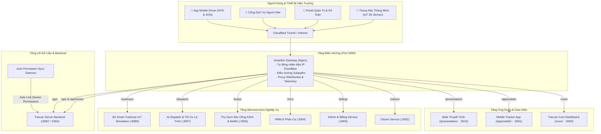

# 🗑️ Smartbin — Hệ Sinh Thái Thu Gom & Quản Lý Rác Thông Minh

> **Smartbin Monorepo** — Nền tảng điều phối rác thông minh, tối ưu lộ trình xe thu gom bằng AI, giám sát thiết bị GPS thời gian thực (Traccar), tích hợp thanh toán MoMo, quản lý nhân sự HRM và mô phỏng thùng rác 3D IoT.

---

## 🌟 1. Tổng Quan Kiến Trúc Hệ Thống

Toàn bộ hệ sinh thái Smartbin được thiết kế theo kiến trúc **Microservices** hướng module độc lập, điều phối thông qua **Unified Nginx Reverse Proxy Gateway** (hỗ trợ Cloudflare Tunnel) và được đóng gói hoàn toàn bằng **Docker Compose Multi-stage build**.



---

## 📁 2. Cấu Trúc Thư Mục Monorepo

```text
Smartbin/
├── apps/
│   ├── core-dashboard/          # Giao diện giám sát & quản trị trung tâm Traccar Core (/core)
│   └── mobile-tracker/          # App GPS độc lập cho tài xế thu gom rác (/appmobile)
├── gateway/
│   ├── nginx.conf               # Cấu hình Gateway điều phối toàn bộ hệ thống & Cloudflare
│   ├── auto_permission_sync.py  # Daemon tự động đồng bộ quyền thiết bị mới
│   ├── Dockerfile
│   └── README.md
├── services/
│   ├── citizen/                 # Microservice cổng người dân phản ánh & xem lịch rác
│   ├── admin-billing/           # Microservice quản lý hóa đơn, tự động thu phí & kế toán
│   ├── hrm/                     # Microservice quản trị nhân sự, chấm công & phân ca tài xế
│   ├── bulky-waste/             # Microservice đặt lịch gom rác cồng kềnh & thanh toán MoMo
│   ├── dispatch/                # Microservice điều phối xe thu gom, thuật toán tối ưu lộ trình
│   └── smart-trashcan-3d/       # Microservice mô phỏng thùng rác thông minh 3D bằng Three.js
├── presentation/
│   ├── index.html               # Slide thuyết trình tương tác toàn bộ dự án
│   ├── open_presentation.sh     # Script mở nhanh slide
│   └── smartbin_presentation_standalone.html
├── docker-compose.yml           # File điều phối khởi chạy toàn bộ 10 microservices
└── README.md                    # Tài liệu hướng dẫn sử dụng
```

---

## 🌐 3. Bảng Ánh Xạ Cổng & Subpath Hệ Thống

| Microservice / Ứng dụng | Cổng Trực Tiếp | Đường Dẫn Qua Gateway (Port 3090) | Mô Tả Chức Năng Nghiệp Vụ |
|---|:---:|:---:|---|
| **Smartbin Gateway** | `3090` | `/` | Cổng vào duy nhất hỗ trợ Cloudflare Tunnel |
| **Mobile Tracker App** | `3001` | `/appmobile/` | App điện thoại tài xế: GPS vệ tinh, trạng thái pin & SOS |
| **Core Dashboard** | `3000` | `/core/` | Bản đồ theo dõi lộ trình thời gian thực & cảnh báo viễn thông |
| **Citizen Service** | `3002` | `/citizen/` | Tra cứu lịch thu gom rác, phản ánh ô nhiễm môi trường |
| **Admin & Billing** | `3003` | `/billing/` | Quản lý hóa đơn dịch vụ vệ sinh, nhắc nợ & đối soát |
| **HRM Service** | `3004` | `/hrm/` | Chấm công GPS, xếp lịch trực và tính lương nhân sự |
| **Bulky Waste Service** | `3006` | `/bulky/` | Đặt lịch lấy rác cồng kềnh, định giá tự động & quét mã MoMo |
| **Dispatch Routing** | `3007` | `/dispatch/` | Điều phối đoàn xe thông minh, thuật toán tối ưu đường đi |
| **Smart Trashcan 3D** | `8080` | `/trashcan/` | Mô phỏng cảm biến siêu âm đầy rác & đồ họa Three.js |
| **Presentation Slides** | `3010` | `/presentation/` | Slide thuyết trình đồ án trực quan tương tác |

---

## 🚀 4. Hướng Dẫn Khởi Chạy Nhanh

### 4.1. Khởi chạy 1 chạm bằng Docker Compose (Khuyên dùng)
Yêu cầu: Đã cài đặt [Docker](https://docs.docker.com/engine/install/) & [Docker Compose](https://docs.docker.com/compose/).

```bash
# 1. Clone toàn bộ dự án
git clone -b main git@github.com:chinhanxt/Smartbin.git
cd Smartbin

# 2. Khởi chạy toàn bộ 10 dịch vụ
docker compose up -d --build

# 3. Kiểm tra trạng thái các container
docker compose ps
```

* 🌍 **Truy cập qua Gateway tập trung**: `http://localhost:3090`
* 📱 **Truy cập App Mobile**: `http://localhost:3090/appmobile`
* 🗺️ **Truy cập Bản Đồ Giám Sát**: `http://localhost:3090/core`
* 📊 **Truy cập Slide Thuyết Trình**: `http://localhost:3090/presentation`

---

### 4.2. Khởi chạy Cloudflare Tunnel công khai
Nếu bạn muốn đưa toàn bộ hệ thống lên Internet cho điện thoại thực tế kết nối:

```bash
cloudflared tunnel --url http://localhost:3090
```
*(Mọi đường dẫn `/appmobile`, `/core`, `/bulky`, v.v. đều hoạt động mượt mà qua URL HTTPS công khai của Cloudflare)*.

---

## 👥 5. Liên Kết Nhánh Phát Triển (Feature Branches)

Dự án duy trì các nhánh con độc lập tương ứng với từng module để các thành viên phát triển song song:

* `main`: Nhánh chính Monorepo hợp nhất toàn bộ hệ thống.
* `webapp`: Nhánh phát triển `apps/mobile-tracker`.
* `project-main`: Nhánh phát triển `apps/core-dashboard`.
* `smartbin-gateway`: Nhánh phát triển Nginx Gateway.
* `dev-congnghip`: Nhánh phát triển `services/dispatch`.
* `dev-EnglandLee`: Nhánh phát triển `services/bulky-waste`.
* `smartbin-hrm-service`: Nhánh phát triển `services/hrm`.
* `smartbin-citizen-service`: Nhánh phát triển `services/citizen`.
* `smartbin-admin-billing-service`: Nhánh phát triển `services/admin-billing`.
* `project`: Nhánh phát triển `services/smart-trashcan-3d`.
* `smartbin-presentation`: Nhánh lưu trữ Slide thuyết trình.
* `traccar-backend`: Nhánh backend Traccar Java Server.
* `traccar-client-android`: Nhánh ứng dụng di động Android gốc.

---

## 📜 6. Giấy Phép & Bản Quyền
Phát triển bởi đội ngũ **Smartbin Team** © 2026.
Mã nguồn mở phục vụ nghiên cứu và phát triển đô thị thông minh.
