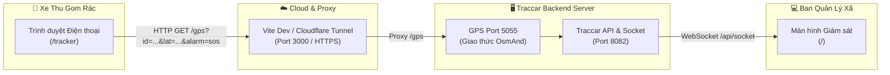

# 🚛 Smartbin - Hệ Thống Giám Sát & Định Vị Thu Gom Rác Thông Minh (Civic-Tech)

Hệ thống điều phối, quản lý và định vị phương tiện thu gom rác thải & điểm tập kết thông minh thời gian thực (Real-time GPS Tracking & Smart Waste Management System), phục vụ chương trình Chuyển đổi số địa phương.


---

## 🌟 Tính Năng Nổi Bật

### 1. 📱 Web Mobile Tracker (`/tracker`) dành cho Tài xế & Xe gom rác
- **Không cần cài đặt app Native**: Hoạt động trực tiếp trên trình duyệt mọi điện thoại (iOS Safari, Android Chrome, Zalo Browser).
- **Định vị GPS vệ tinh độ chính xác cao**: Tự động lấy toạ độ vệ tinh (sai số chỉ 5 - 15m), vận tốc km/h và hướng la bàn.
- **Nút Kết nối tức thì (< 50ms)**: Đồng bộ toạ độ về máy chủ ngay lập tức với bộ đệm bộ nhớ đệm thông minh.
- **Nút Báo động SOS khẩn cấp**: Phát chuỗi tín hiệu ưu tiên (`alarm=sos`) về phòng điều hành, kích hoạt còi hú và thông báo cảnh báo tức thì.
- **Giám sát pin thông minh (Hybrid Battery)**: Hỗ trợ đọc pin phần cứng hoặc pin mô phỏng IoT, liên tục báo cáo % pin và trạng thái cắm sạc.
- **Hỗ trợ đa phương tiện**: Cho phép chọn xe (Xe 01, Xe 02, Thùng rác 01...) hoặc sinh mã ngẫu nhiên để tránh xung đột dữ liệu giữa nhiều thiết bị.
- **Mã QR chia sẻ nhanh**: Quét bằng camera điện thoại để mở bộ phát GPS ngay lập tức.

### 2. 🗺️ Trung tâm Giám sát Bản đồ (`/`)
- **Bản đồ thời gian thực (Live Map)**: Theo dõi lộ trình di chuyển của toàn bộ đội xe rác trên địa bàn xã/phường.
- **Cảnh báo SOS trung tâm**: Tự động phát âm thanh cảnh báo và hiển thị hộp thoại khẩn cấp khi xe gặp sự cố.
- **Báo cáo & Lịch sử**: Xem lại hành trình, dừng đỗ, quãng đường tiêu hao nhiên liệu.
- **Vùng địa lý (Geofencing)**: Thiết lập ranh giới điểm tập kết rác, bãi chôn lấp, trạm trung chuyển.

---

## 🏗️ Kiến Trúc Hệ Thống



---

## 🚀 Hướng Dẫn Cài Đặt & Phát Triển (Dành cho Team)

### Yêu Cầu Tiên Quyết
- **Node.js**: >= 18.x
- **Docker**: Để chạy Traccar Backend Server (Port 8082 & Port 5055)

### 1. Khởi động Backend Traccar (Docker)
```bash
docker run -d --name traccar-server \
  -p 8082:8082 -p 5055:5055 \
  traccar/traccar:latest
```
* Tài khoản quản trị mặc định: `admin` / `admin` (hoặc tạo tài khoản theo quy chuẩn của đơn vị).

### 2. Cài đặt Thư Viện Frontend
```bash
git clone https://github.com/chinhanxt/Smartbin.git
cd Smartbin
npm install
```

### 3. Chạy Môi Trường Phát Triển (Local Dev)
```bash
npm start
```
- **Web App**: `http://localhost:3000`
- **Bộ phát GPS Mobile**: `http://localhost:3000/tracker`
- Vite tự động proxy:
  - `/api` ➔ `http://localhost:8082/api`
  - `/gps` ➔ `http://localhost:5055/?`

### 4. Build Bản Triển Khai Sản Phẩm (Production)
```bash
npm run build
```
Mã nguồn tối ưu sau khi build sẽ nằm trong thư mục `build/`, sẵn sàng đưa lên Cloudflare Pages, Vercel, hoặc Nginx.

---

## 📂 Cấu Trúc Thư Mục Quan Trọng

```text
Smartbin/
├── public/                     # Tài nguyên tĩnh, logo.svg, manifest PWA
├── src/
│   ├── other/
│   │   └── MobileTrackerPage.jsx  # 🌟 Toàn bộ giao diện & logic bộ phát GPS di động Smartbin
│   ├── main/                   # Giao diện bản đồ giám sát trung tâm
│   │   ├── MainPage.jsx
│   │   ├── DeviceRow.jsx       # Hiển thị thông tin xe, pin, vận tốc
│   │   └── EventsDrawer.jsx    # Lịch sử sự kiện, cảnh báo
│   ├── SocketController.jsx    # Nhận WebSocket realtime và thông báo âm thanh SOS
│   ├── Navigation.jsx          # Định tuyến (Router)
│   └── vite.config.js          # Cấu hình Proxy và Build
└── package.json
```

---

## 📡 Chuẩn Giao Thức Truyền Tin GPS (OsmAnd Protocol)

Bộ phát Mobile gửi dữ liệu toạ độ định kỳ bằng HTTP GET về endpoint `/gps`:
```http
GET /gps?id={deviceId}&lat={lat}&lon={lon}&timestamp={timestamp}&speed={speedKnots}&bearing={heading}&accuracy={acc}&batt={batteryLevel}&charge={isCharging}&alarm={alarmType}
```
| Tham số | Ý nghĩa | Ví dụ |
| :--- | :--- | :--- |
| `id` | Mã định danh xe / thùng rác | `81891318`, `BIN-001` |
| `timestamp` | Thời gian gửi (giây Epoch) | `1789580341` |
| `lat`, `lon` | Toạ độ vệ tinh WGS84 | `10.845671, 106.813482` |
| `speed` | Vận tốc chuyển đổi ra Knot | `15.5` |
| `bearing` | Góc la bàn di chuyển (0 - 360°) | `90.0` |
| `accuracy` | Độ chính xác bán kính mét | `12.5` |
| `batt` | Phần trăm pin thiết bị (0 - 100) | `95` |
| `charge` | Đang cắm sạc (`true`/`false`) | `true` |
| `alarm` | Báo động khẩn cấp | `sos` |

---

## 👥 Tác Giả & Bản Quyền
Dự án được phát triển và tối ưu cho nền tảng Chuyển đổi số Quản lý Rác thông minh Smartbin.  
Phát triển bởi **chinhanxt & Team**. Giấy phép nguồn mở Apache License 2.0.
